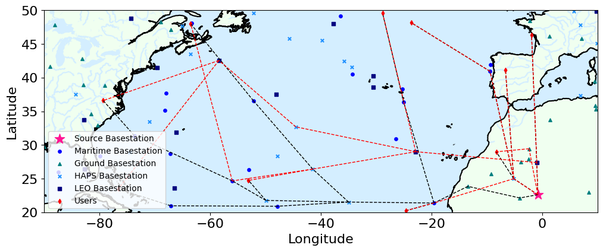

<div align="center">    

# SSIR: Secure SAGSIN IAB Relay Network


[](asdf/)
[](LICENSE.txt)

</div>

SSIR is a comprehensive implementation of multi-hop relaying space-air-ground-sea integrated networks; and an official implementation of the paper titled "-".
This repository contains a variety of routing algorithms including A*(or Dijkstra), genetic algorithm, graph convolutional network (GCN), and graph attention network (GAT).

## Installation

Pip from source:

```bash
git clone https://github.com/hslyu/SSIR
 
cd SSIR
pip install .   
 ```
______________________________________________________________________

## Quickstart
```
from ssir import environment as env

dm = env.DataManager()
pm = env.PlotManager()
master_graph = dm.generate_master_graph()

costs, predecessors_distance = pf.a_star(master_graph, metric="distance")
graph = pf.get_solution_graph(graph, predecessors_distance)

pm.plot_dm(dm, graph)
```


______________________________________________________________________

### Overview
______________________________________________________________________

## Contributors
- [Hyeonsu Lyu](https://www.lyu.kr/)
______________________________________________________________________

## Acknowledgements

______________________________________________________________________

## Reference
If you find the code is helpful, please refer our paper!
```
@ARTICLE{10791413,
  author={Lyu, Hyeonsu and Jang, Jonggyu and Lee, Harim and Yang, Hyun Jong},
  journal={IEEE Transactions on Wireless Communications}, 
  title={Non-iterative Optimization of Trajectory and Radio Resource for Aerial Network}, 
  year={2024},
  volume={},
  number={},
  pages={1-1},
  keywords={Trajectory;Optimization;Quality of service;Wireless communication;Downlink;Internet of Things;Resource management;Power control;Iterative methods;Markov decision processes;Trajectory-planning;user association;resource allocation;power control;quality-of-service;Markov decision process},
  doi={10.1109/TWC.2024.3510043}}
```
